# Eden Architecture

## System Overview

Eden is a three-layer system: the **Eve Horizon platform** runs AI agents, the **Eden application** stores and serves data, and the **web UI** renders the story map.

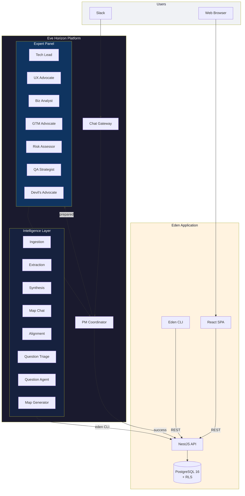

## Staged Council Dispatch

The core dispatch pattern. The coordinator runs first and decides: handle it solo, or fan out to the expert panel.

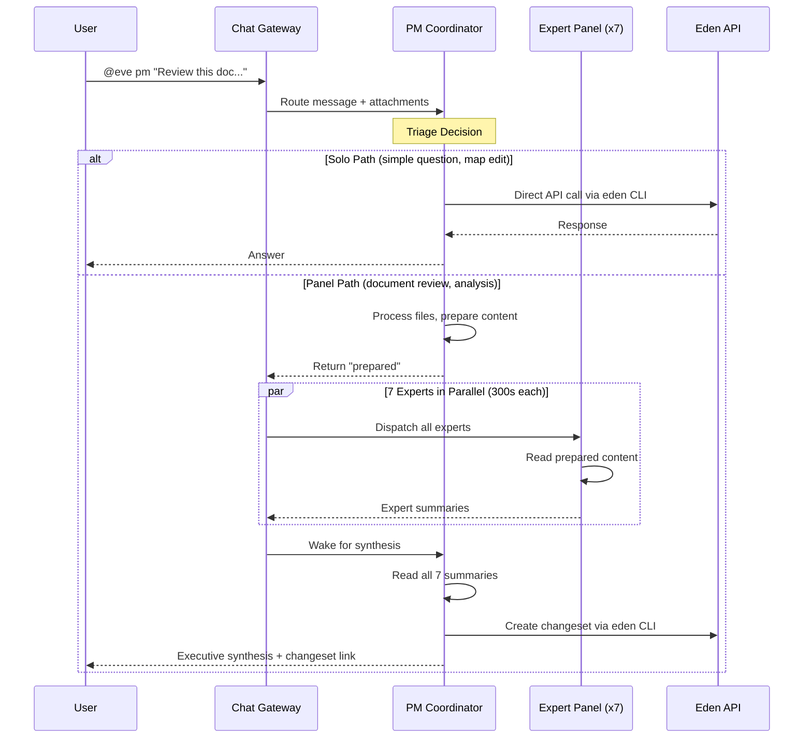

## Document Ingestion Pipeline

When a document is uploaded, agents work sequentially to extract requirements and propose changes to the story map. Note: the ingestion step runs on the platform side (content extraction from PDF/DOCX/audio/video) — the extraction and synthesis agents receive the extracted text.

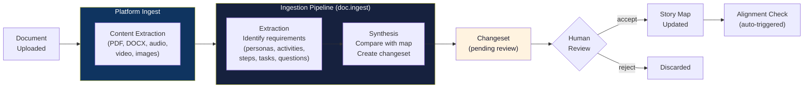

## Project Wizard Flow

When a user creates a new project, the wizard generates an initial story map from a project description and optional uploaded documents.

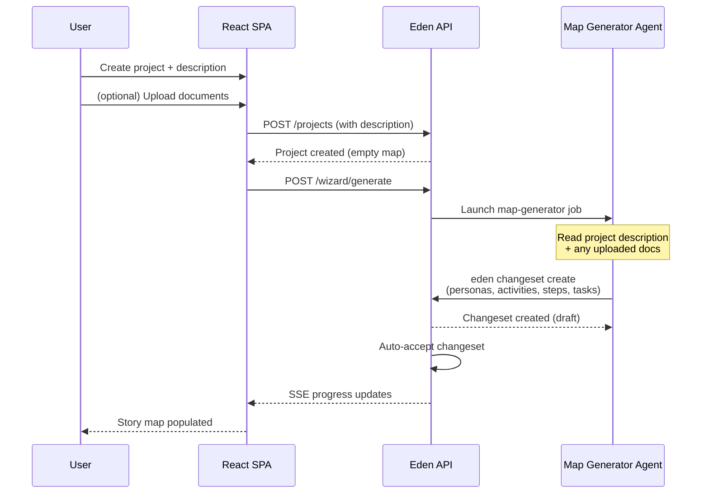

## Event-Driven Intelligence

Three workflows fire automatically on domain events, creating a feedback loop that keeps the story map consistent and evolving. The question-evolution workflow uses a two-step triage pattern: a fast classifier decides whether the answer warrants a map change before invoking the heavier question agent.

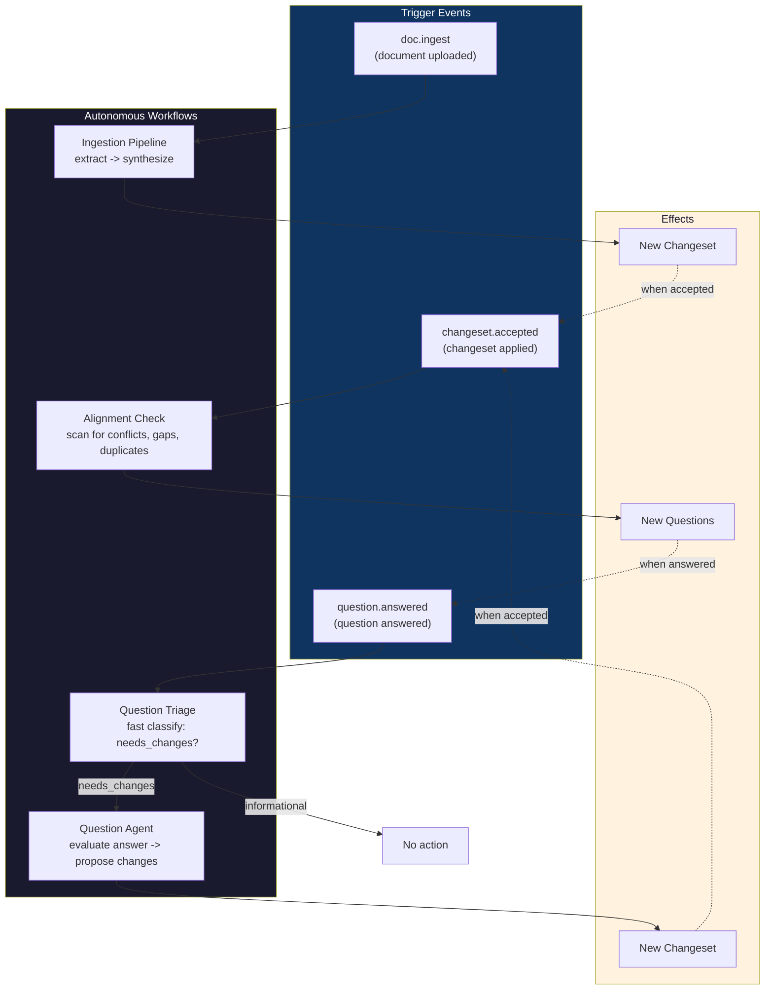

## Story Map Data Model

The hierarchical structure of the story map and its supporting entities. Phase 6 added project membership, saved views, notifications, and project invites.

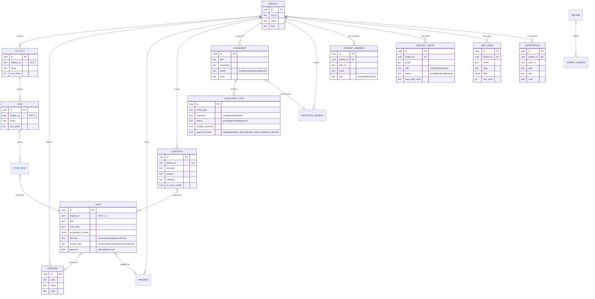

## API Architecture

The NestJS API is organized into domain modules, each with its own controller and service. All endpoints are protected by an auth guard and scoped by RLS. Agents access the API exclusively through the `eden` CLI — never via direct REST calls.

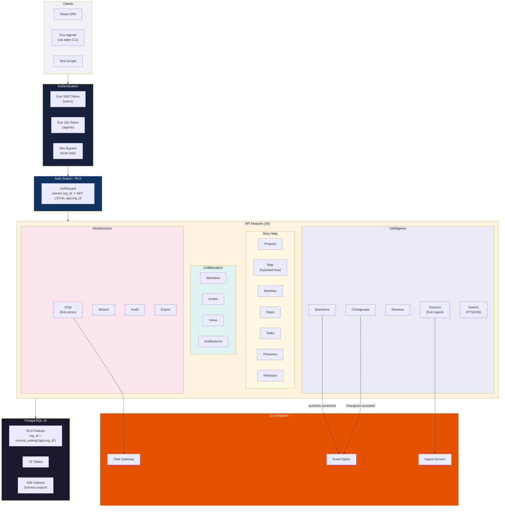

## Web Application

The React SPA with its page hierarchy and component architecture. Authentication uses Eve SSO via `@eve-horizon/auth-react`.

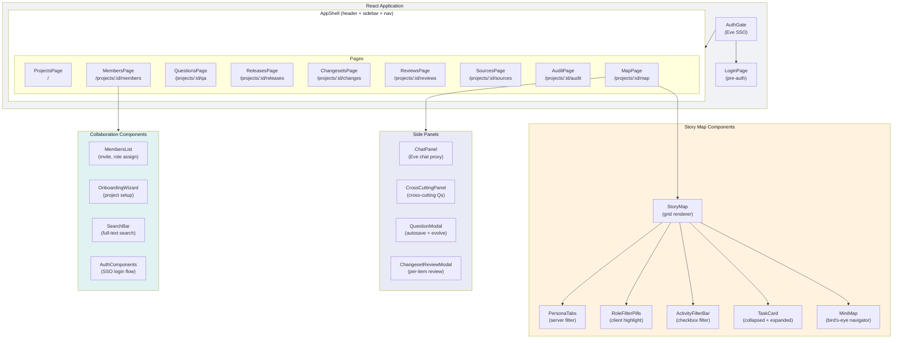

## Changeset Lifecycle

The changeset system decouples proposal from acceptance. Every AI-proposed change follows this path. Phase 6a added two-stage approval for owner review.

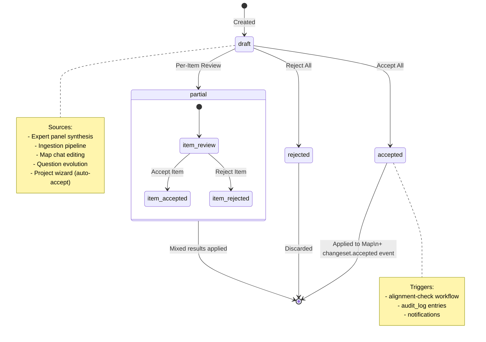

## Deployment

Eden deploys to Eve Horizon's managed infrastructure via a manifest-driven pipeline.

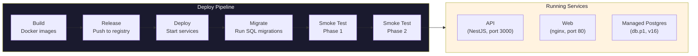

## Security Model

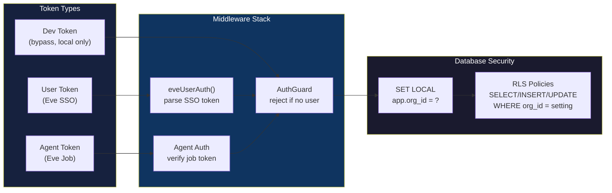

## Agent Topology

All 16 agents and how they connect. Agents access the Eden API exclusively through the `eden` CLI — never via direct REST calls.

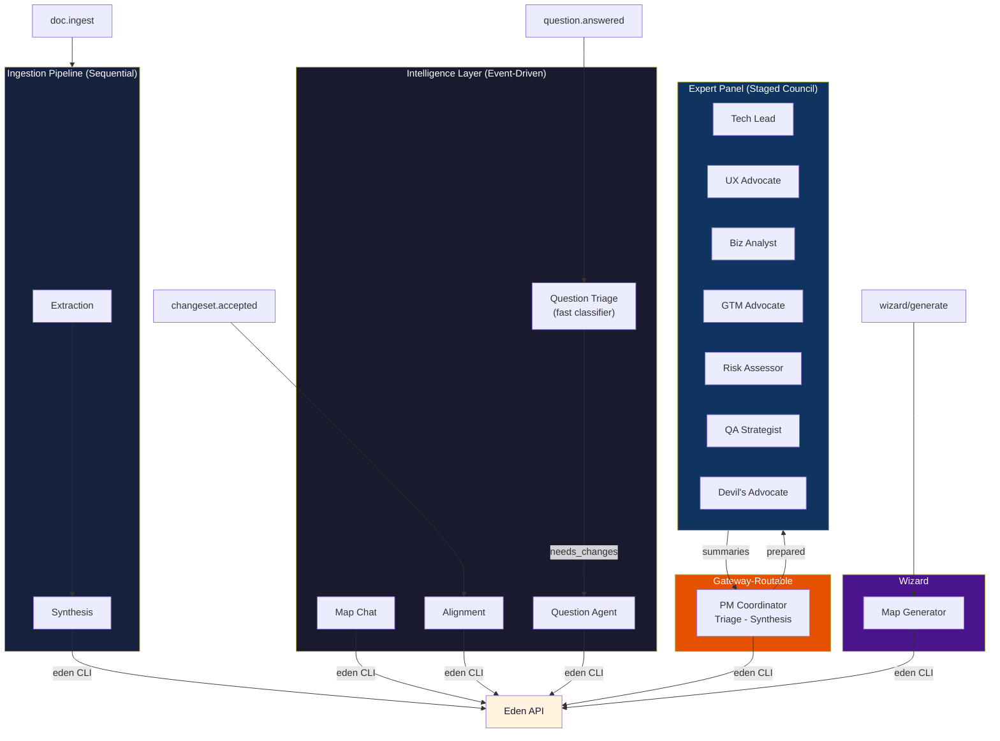

## CLI Architecture

The `eden` CLI wraps every non-webhook REST endpoint, providing the canonical interface for agents and humans. Agents must use the CLI — never raw REST calls.

```mermaid
graph LR
    subgraph users["Users"]
        human["Developers"]
        agents["Eve Agents"]
    end

    subgraph cli["eden CLI (cli/)"]
        direction TB
        auth_cmd["auth"]
        proj["projects"]
        map_cmd["map"]
        act["activities"]
        stp["steps"]
        tsk["tasks"]
        per["personas"]
        cs["changesets"]
        q["questions"]
        rel["releases"]
        src["sources"]
        chat_cmd["chat"]
        mem["members"]
        inv["invites"]
        vw["views"]
        ntf["notifications"]
        wiz["wizard"]
        rev["reviews"]
        aud["audit"]
        exp["export"]
        srch["search"]
    end

    subgraph api["Eden REST API"]
        rest["20 Module Endpoints"]
    end

    human --> cli
    agents --> cli
    cli -->|"HTTP + Bearer token"| api

    style users fill:#f0f2f5,color:#1a1a2e
    style cli fill:#e8eaf6,color:#1a1a2e
    style api fill:#fff3e0,color:#1a1a2e
```
