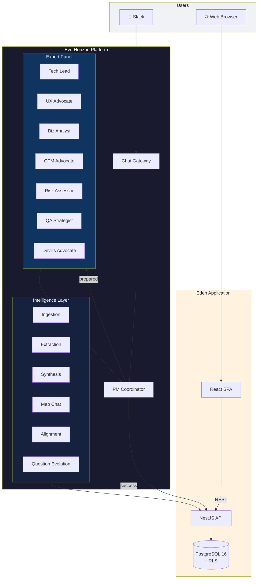
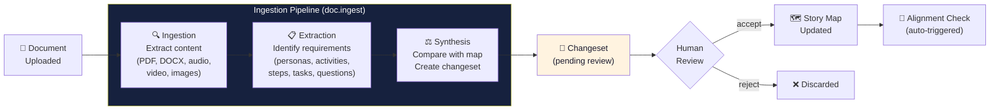
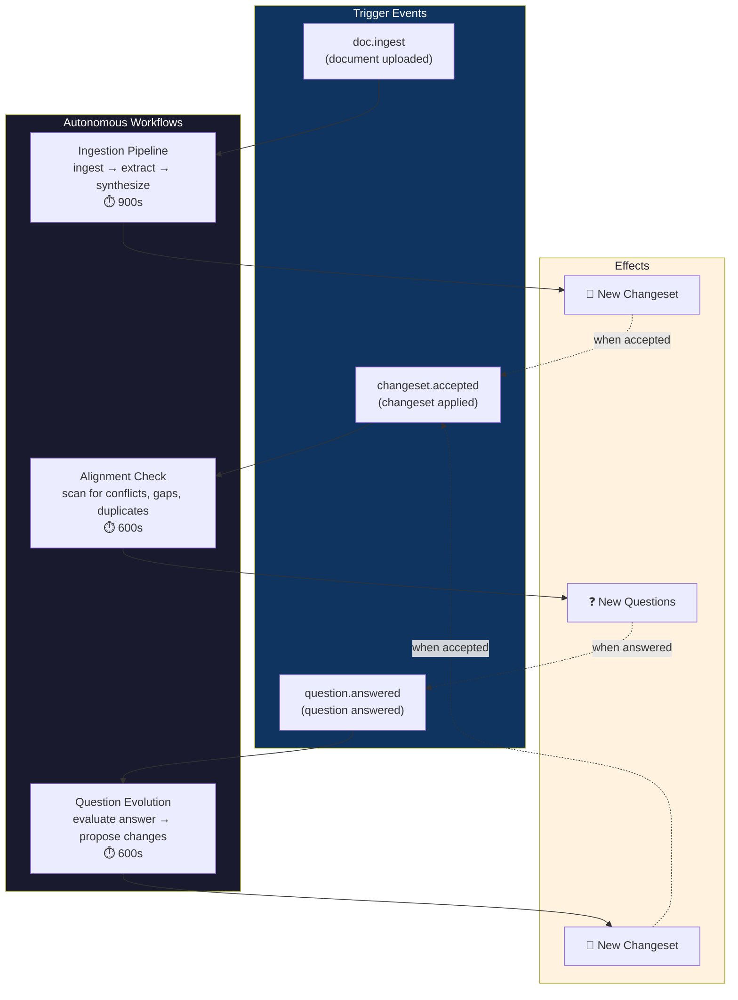
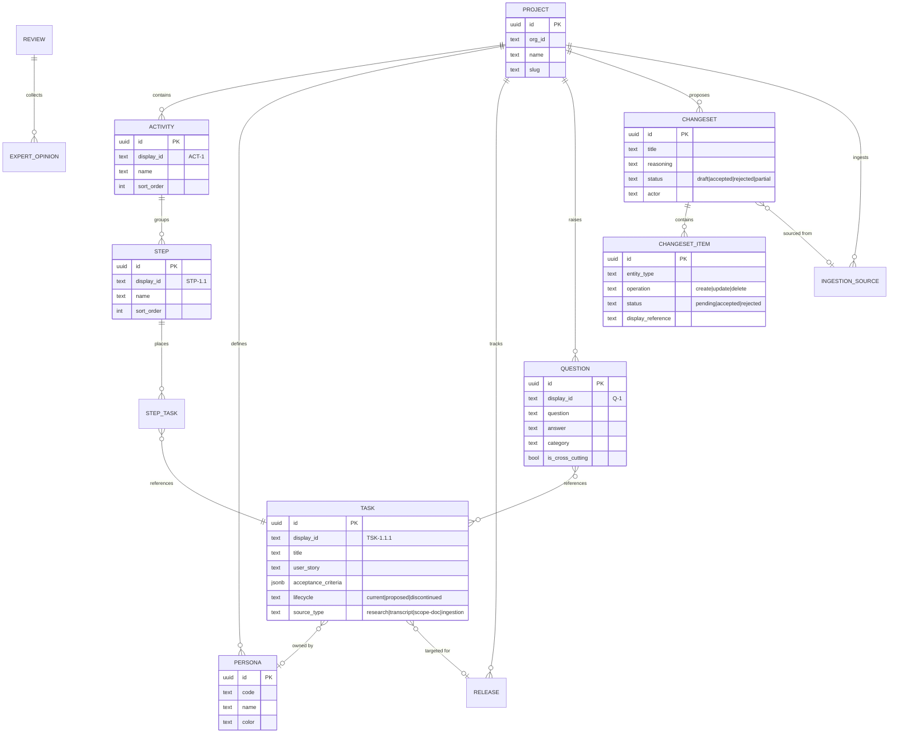
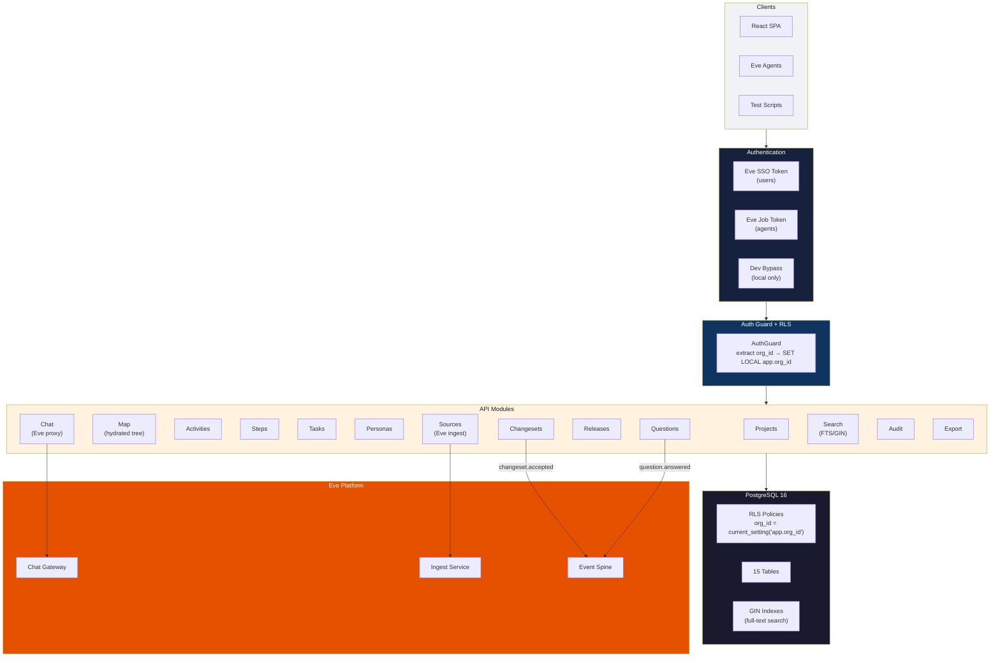
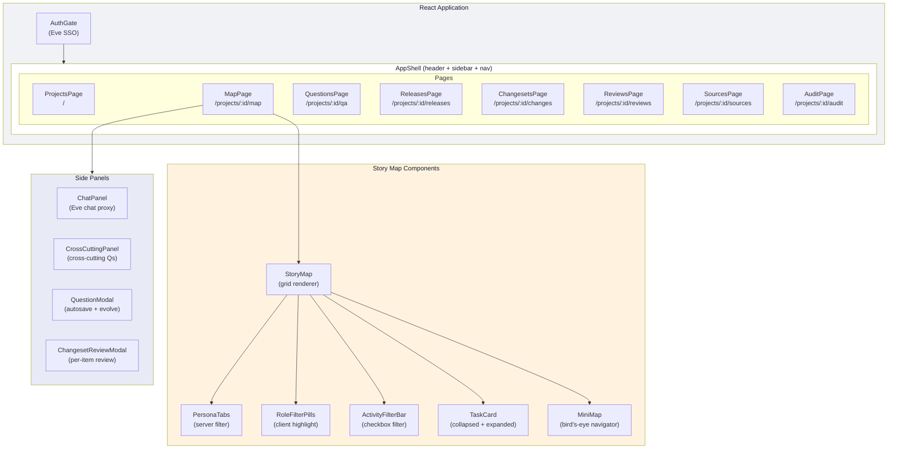
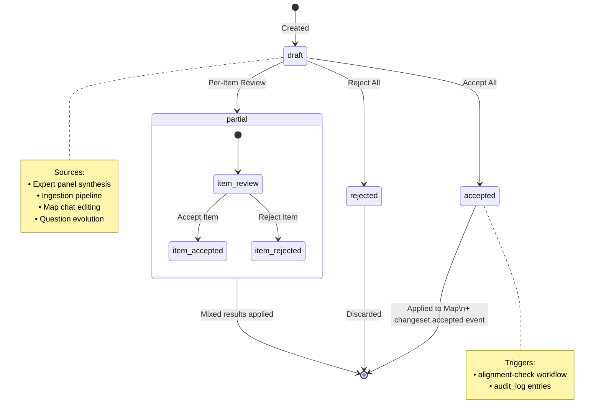
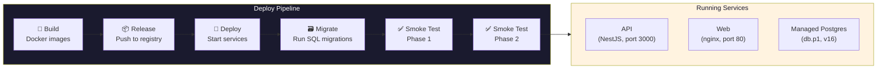
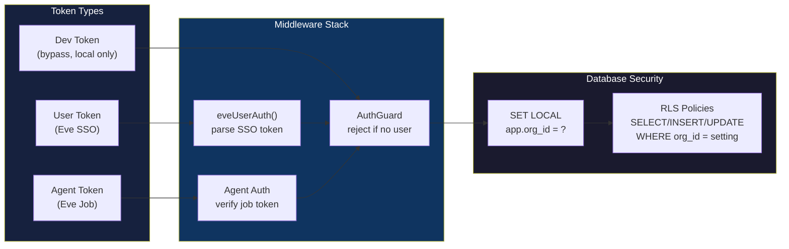
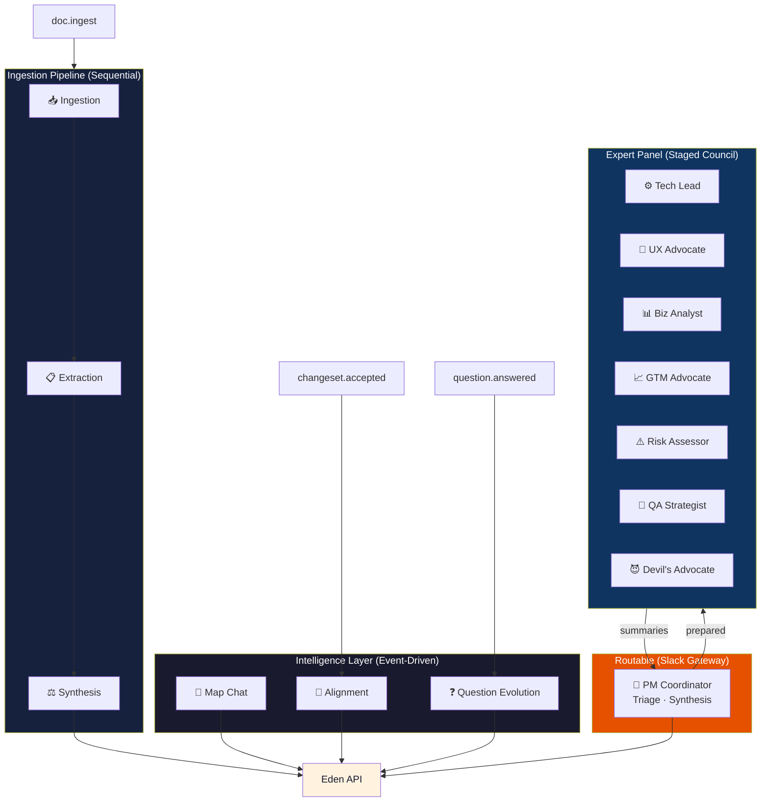

# Eden Architecture

## System Overview

Eden is a three-layer system: the **Eve Horizon platform** runs AI agents, the **Eden application** stores and serves data, and the **web UI** renders the story map.

## Staged Council Dispatch

The core dispatch pattern. The coordinator runs first and decides: handle it solo, or fan out to the expert panel.

## Document Ingestion Pipeline

When a document is uploaded, three agents work sequentially to extract requirements and propose changes to the story map.

## Event-Driven Intelligence

Three workflows fire automatically on domain events, creating a feedback loop that keeps the story map consistent and evolving.

## Story Map Data Model

The hierarchical structure of the story map and its supporting entities.

## API Architecture

The NestJS API is organized into domain modules, each with its own controller and service. All endpoints are protected by an auth guard and scoped by RLS.

## Web Application

The React SPA with its page hierarchy and component architecture.

## Changeset Lifecycle

The changeset system decouples proposal from acceptance. Every AI-proposed change follows this path:

## Deployment

Eden deploys to Eve Horizon's managed infrastructure via a manifest-driven pipeline.

## Security Model

## Agent Topology

All 14 agents and how they connect:

