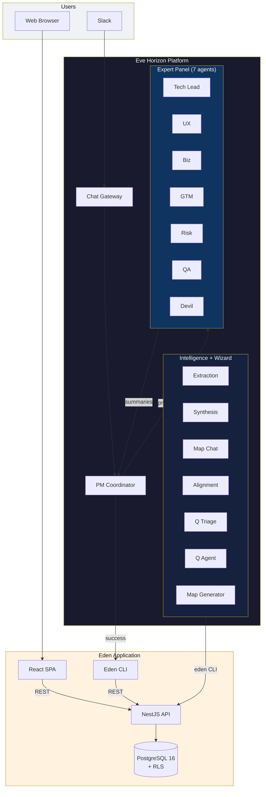

# Eden — AI-First Requirements Platform

An Eve Horizon application that combines an **expert panel engine**, an **intelligent document pipeline**, and a **living story map** for AI-first requirements management.

## How It Works

Teams share documents, conversations, and ideas with `@eve pm`. Eden's coordinator triages the input and decides the path:

**Solo path** — Simple questions, map edits, search queries. The coordinator handles it directly.

**Panel path** — Documents, proposals, substantial analysis. Seven expert agents review in parallel:

| Expert | Focus |
|--------|-------|
| Tech Lead | Feasibility, architecture, cost, engineering risk |
| UX Advocate | User experience, accessibility, i18n readiness |
| Business Analyst | Process flows, user journeys, success criteria |
| GTM Advocate | Revenue impact, competitive positioning, launch readiness |
| Risk Assessor | Timeline, dependency, regulatory risk |
| QA Strategist | Testing strategy, edge cases, acceptance criteria |
| Devil's Advocate | Challenges assumptions, proposes alternatives |

The coordinator synthesizes all expert opinions into actionable requirements — personas, activities, steps, tasks, questions — rendered on a living **story map**.

**Intelligence layer** — Three event-driven workflows keep the map alive:

- **Ingestion pipeline** — Upload a document -> extract content -> identify requirements -> propose a changeset
- **Alignment check** — After a changeset is accepted, scan the map for conflicts, gaps, and duplicates
- **Question evolution** — When a question is answered, a fast triage classifier decides if the answer implies a map change; if so, the question agent proposes a changeset

**Project wizard** — New projects can be bootstrapped from a description (and optional uploaded documents). The map-generator agent creates an initial story map as a changeset that is auto-accepted.

Every AI-proposed change goes through the **changeset system** — per-item review before anything touches the map.

## Architecture



See [ARCHITECTURE.md](ARCHITECTURE.md) for detailed mermaid diagrams (staged council, ingestion pipeline, wizard flow, data model, security model, and agent topology).

## Quick Start

### Prerequisites

- Node.js 20+
- Docker (for local PostgreSQL)
- Eve CLI (`eve`) — for staging deploys and agent sync
- Eve org membership in `org_Incept5` — ask Adam (`adam@incept5.com`) for access

### Local Development (Docker)

```bash
# Start PostgreSQL + run migrations
docker-compose up -d

# Start the API (port 3000)
cd apps/api && npm install && npm run start:dev

# Start the web app (port 5175, proxies /api to :3000)
cd apps/web && npm install && npm run dev
```

Open `http://localhost:5175`. Auth is bypassed locally (`DEV_AUTH_BYPASS=1`).

### Staging Deployment (Eve)

```bash
# Authenticate with Eve
eve auth login --email you@incept5.com

# Sync agent config (after changing agents/teams/chat)
eve agents sync --local --allow-dirty

# Deploy (ALWAYS use --repo-dir . to sync manifest)
eve env deploy sandbox --ref HEAD --repo-dir .

# Verify
curl -sI https://eden.eh1.incept5.dev       # Web (should be 200)
curl -sI https://api.incept5-eden-sandbox.eh1.incept5.dev/health  # API
```

**Important:** Never run `eve env deploy` without `--repo-dir .` — this is the #1 cause of deploy failures. See [CLAUDE.md](CLAUDE.md) for the full explanation.

## Project Structure

```
eden/
├── apps/
│   ├── api/                    # NestJS REST API (20 domain modules)
│   │   └── src/
│   │       ├── projects/       # Project CRUD
│   │       ├── activities/     # Story map backbone
│   │       ├── steps/          # Steps under activities
│   │       ├── tasks/          # Tasks under steps
│   │       ├── personas/       # User archetypes
│   │       ├── releases/       # Release tracking
│   │       ├── questions/      # Q&A + evolution trigger
│   │       ├── changesets/     # Changeset create/review/apply
│   │       ├── map/            # Hydrated map endpoint
│   │       ├── chat/           # Chat threads + Eve gateway proxy
│   │       ├── sources/        # Document ingestion sources
│   │       ├── search/         # Full-text search (GIN indexes)
│   │       ├── audit/          # Immutable audit trail
│   │       ├── export/         # CSV + JSON export
│   │       ├── reviews/        # Expert panel review records
│   │       ├── members/        # Project membership (owner/editor/viewer)
│   │       ├── invites/        # Project invite workflow
│   │       ├── views/          # Saved map view tabs
│   │       ├── notifications/  # User-scoped alerts
│   │       ├── wizard/         # Project wizard (map generation)
│   │       ├── contracts/      # Changeset contract (Zod + JSON schema)
│   │       ├── health/         # Readiness check
│   │       └── common/         # Auth guard, DB service, Eve events
│   └── web/                    # React 18 + Vite + Tailwind SPA
│       └── src/
│           ├── pages/          # 9 project pages + LoginPage
│           ├── components/
│           │   ├── map/        # StoryMap grid, TaskCard, filters, MiniMap
│           │   ├── chat/       # ChatPanel, messages, typing indicator
│           │   ├── questions/  # QuestionModal, CrossCuttingPanel
│           │   ├── changesets/ # ChangesetReviewModal
│           │   ├── layout/     # AppShell (header, sidebar, nav)
│           │   ├── auth/       # SSO login flow
│           │   ├── members/    # Member list, invite flow, roles
│           │   ├── onboarding/ # Project wizard UI
│           │   ├── projects/   # Project list, create dialog
│           │   └── search/     # Search bar, results
│           ├── hooks/          # useProjects, useMembers, useProjectRole, etc.
│           └── api/            # Fetch client with Eve auth
├── cli/                        # Eden CLI (22 command modules)
│   └── src/commands/           # One file per resource (activities, changesets, etc.)
├── db/
│   └── migrations/             # 8 PostgreSQL migrations (RLS, GIN, roles, views)
├── eve/                        # Eve Horizon agent config
│   ├── agents.yaml             # 16 agents
│   ├── teams.yaml              # expert-panel (staged council, 7 members)
│   ├── chat.yaml               # Catch-all route -> team:expert-panel
│   ├── workflows.yaml          # 3 workflows (ingest, align, evolve)
│   ├── x-eve.yaml              # Harness profiles (Claude Sonnet, 5 tiers)
│   └── pack.yaml               # Pack descriptor
├── skills/                     # 16 SKILL.md persona files + shared references
├── scripts/                    # Smoke tests, contract checks, scenario runners
├── tests/
│   ├── e2e/                    # Playwright specs
│   └── manual/scenarios/       # 23 test scenario docs
├── docs/
│   ├── plans/                  # Phase plans (1-7) + feature plans
│   ├── prd/                    # Product requirements
│   └── reports/                # Generated reports
├── docker-compose.yml          # Local dev (Postgres 16 + eve-migrate)
├── .eve/manifest.yaml          # Eve deployment manifest
├── ARCHITECTURE.md             # System diagrams (mermaid)
├── CLAUDE.md                   # AI coding assistant instructions
└── AGENTS.md                   # Autonomous agent protocol
```

## Key Concepts

### Story Map

A hierarchical grid: **Activities** -> **Steps** -> **Tasks**. Each task has a user story, acceptance criteria, persona assignments, and linked questions. The map is the single source of truth for what the product should do.

### Changesets

Every proposed change to the map — whether from a human, the expert panel, the ingestion pipeline, or conversational editing — is captured as a changeset with individual items. Each item can be accepted or rejected before it touches the map. Full audit trail. Phase 6a added two-stage approval for owner review.

### Staged Council Dispatch

The coordinator runs first. If it returns `prepared`, seven experts activate in parallel (300s each). The coordinator wakes to synthesize. If the coordinator handles it solo (`success`), experts never start. Cheap triage, expensive analysis only when needed.

### Question Triage Pattern

The question-evolution workflow uses a two-step design: a fast triage classifier determines if an answered question implies a map change (`needs_changes`) or is purely informational. Only `needs_changes` triggers the heavier question agent. This saves compute by avoiding unnecessary agent runs.

### Project Roles

Three-tier role model at the project level: **owner** (full control), **editor** (can edit map, answer questions), **viewer** (read-only). Managed via the Members page and invite flow.

### Row-Level Security

Every database query runs inside a transaction that sets `app.org_id` via PostgreSQL config. RLS policies enforce org-scoped data isolation at the database level — no application-level filtering needed.

### Eden CLI

The `eden` CLI wraps every non-webhook REST endpoint. All agents must use the CLI — never raw REST calls. This ensures consistent auth handling, error formatting, and a single interface for both humans and agents.

## Agents (16 total)

| Agent | Slug | Type | Role |
|-------|------|------|------|
| PM Coordinator | `pm` | routable | Triage, file processing, panel dispatch, synthesis |
| Tech Lead | `tech-lead` | expert panel | Technical feasibility, architecture |
| UX Advocate | `ux-advocate` | expert panel | UX, accessibility, i18n |
| Business Analyst | `biz-analyst` | expert panel | Process flows, success criteria |
| GTM Advocate | `gtm-advocate` | expert panel | Revenue, competitive positioning |
| Risk Assessor | `risk-assessor` | expert panel | Timeline, dependency, regulatory risk |
| QA Strategist | `qa-strategist` | expert panel | Test strategy, edge cases |
| Devil's Advocate | `devils-advocate` | expert panel | Challenge assumptions |
| Extraction | `extraction` | pipeline | Identify requirements from content |
| Synthesis | `synthesis` | pipeline | Compare with map, create changeset |
| Map Chat | `map-chat` | intelligence | Conversational map editing |
| Alignment | `alignment` | intelligence | Post-changeset conflict/gap scan |
| Question Triage | `question-triage` | intelligence | Fast answer classification |
| Question Agent | `question-agent` | intelligence | Answer -> map change evaluation |
| Map Generator | `map-generator` | wizard | Generate initial story map |

## API Endpoints

| Resource | Endpoints |
|----------|-----------|
| Projects | `GET/POST /projects`, `GET/PATCH/DELETE /projects/:id` |
| Map | `GET /projects/:id/map?persona=&release=` |
| Activities | `GET/POST /projects/:id/activities`, `PATCH/DELETE /activities/:id` |
| Steps | `GET/POST /projects/:id/steps`, `PATCH/DELETE /steps/:id` |
| Tasks | `GET/POST /projects/:id/tasks`, `GET/PATCH/DELETE /tasks/:id` |
| Personas | `GET/POST /projects/:id/personas`, `GET/PATCH/DELETE /personas/:id` |
| Questions | `GET/POST /projects/:id/questions`, `GET/PATCH /questions/:id`, `POST /questions/:id/evolve` |
| Changesets | `GET/POST /projects/:id/changesets`, `GET /changesets/:id`, `POST /changesets/:id/{accept,reject,review}` |
| Releases | `GET/POST /projects/:id/releases`, `PATCH/DELETE /releases/:id` |
| Chat | `GET/POST /projects/:id/chat/threads`, `GET/POST /chat/threads/:id/messages` |
| Sources | `GET/POST /projects/:id/sources`, `POST /sources/:id/confirm` |
| Members | `GET/POST /projects/:id/members`, `PATCH/DELETE /members/:id` |
| Invites | `GET/POST /projects/:id/invites`, `POST /invites/:id/claim` |
| Views | `GET/POST /projects/:id/views`, `PATCH/DELETE /views/:id` |
| Notifications | `GET /projects/:id/notifications`, `PATCH /notifications/:id/read` |
| Reviews | `GET /projects/:id/reviews`, `GET /reviews/:id` |
| Wizard | `POST /projects/:id/wizard/generate` |
| Search | `GET /projects/:id/search?q=` |
| Audit | `GET /projects/:id/audit` |
| Export | `GET /projects/:id/export/{story-map,csv}` |

## UX Prototype Reference

The web UI design draws from Ade's UX prototype — a separate React SPA built with React 19, Supabase, and Vite. It lives in a different repo:

- **GitHub**: `Incept5/eden` (private, under the Incept5 org)
- **Not a dependency** — it's a design reference, not imported or linked at build time
- **Different stack** — React 19 + Supabase (prototype) vs React 18 + Eve Auth (production)

If you want to reference the prototype locally, clone it alongside this repo. There is no fixed path — use wherever makes sense for your setup.

## Testing

```bash
# Local smoke tests (Docker + API + Web running)
./scripts/smoke-test-local-p2.sh
./scripts/smoke-test-local-p3.sh
./scripts/smoke-test-local-p4.sh

# Staging smoke tests (Eve deployed)
./scripts/smoke-test.sh
./scripts/smoke-test-p2.sh
./scripts/smoke-test-p3.sh

# E2E (Playwright)
npx playwright test tests/e2e/

# Changeset contract drift check
./scripts/check-contract-drift.sh

# Story map parity verification
./scripts/verify-story-map-parity.sh
```

See `tests/manual/scenarios/` for 23 test scenario documents.

## Phase Roadmap

Eden is delivered in phases. See `docs/plans/` for detailed plans.

| Phase | Name | Status | Key Deliverables |
|-------|------|--------|-----------------|
| 1 | Foundation | Complete | NestJS API, React SPA, 15-table DB, RLS |
| 2 | Changesets & Ingestion | Complete | Changeset system, 3 pipeline agents |
| 3 | Intelligence | Complete | Map Chat, Alignment, Question Evolution |
| 4 | Polish | Complete | Lifecycle, provenance, FTS, display IDs |
| 5 | Private Models | Planned | Qwen3.5 via Ollama + Tailscale |
| 6 | UX Convergence | Complete | Wizard, roles, collaboration, invites, views |
| 7 | Chat Mentions & UX Parity | In progress | @mentions, notification UX, chat improvements |

## Contributing

### Access

1. **Eve org membership** — Ask Adam (`adam@incept5.com`) to add you to `org_Incept5`
2. **Eve project access** — You need admin role on the Eden project to deploy to sandbox
3. **GitHub collaborator** — You need write access to `eve-horizon/eden`

### Setup

```bash
git clone git@github.com:eve-horizon/eden.git
cd eden

# Install Eve CLI (if not already installed)
# See Eve Horizon docs for installation

# Authenticate
eve auth login --email you@incept5.com

# Local dev
docker-compose up -d
cd apps/api && npm install && npm run start:dev
# In another terminal:
cd apps/web && npm install && npm run dev
```

### Key Rules

- **Never edit existing migrations** — always create a new file with the next timestamp
- **CLI/API parity** — every API change needs a matching CLI update in `cli/src/commands/`
- **Agents use the CLI** — never raw REST. If a CLI command is missing, add it first
- **Inline skill templates** — keep JSON schemas inline in SKILL.md, not in reference files
- **Deploy with `--repo-dir .`** — always, no exceptions

### Issue Tracking

This project uses `bd` (beads) for issue tracking. Run `bd onboard` to get started, then `bd ready` to find available work.

## Tech Stack

| Layer | Technology |
|-------|-----------|
| API | NestJS 11, Express 5, TypeScript 5.6 |
| Database | PostgreSQL 16, RLS, GIN full-text search |
| Frontend | React 18, Vite 6, Tailwind CSS 3, React Router 6 |
| Auth | Eve SSO (`@eve-horizon/auth`, `@eve-horizon/auth-react`) |
| CLI | TypeScript, Commander.js |
| Agents | 16 Claude Sonnet agents via Eve Horizon |
| Deploy | Eve Horizon (manifest-driven, managed Postgres) |
| Local Dev | Docker Compose (Postgres 16 + eve-migrate) |
